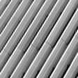
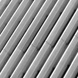
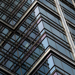
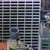
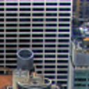
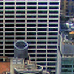
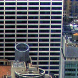
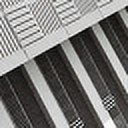

# DyConSR Pytorch Lightning

## Paper

Comming soon ...

## Installation
Python = 3.8.10

I use version `pytorch = 2.1.2 + cuda 11.8`, `lightning = 2.1.1`. I'm not sure if it works with other versions.

Then install the requirements: `pip install -r requirements.txt`


## Dataset Preparation

I use [DIV2K](https://data.vision.ee.ethz.ch/cvl/DIV2K/) and Flickr2K dataset for training and DIV2K validation set for validation. You can download the DIV2K dataset from [here](https://data.vision.ee.ethz.ch/cvl/DIV2K/) and Flickr2K dataset from [here](https://huggingface.co/datasets/goodfellowliu/Flickr2K/resolve/main/Flickr2K.zip). 

In the training dataset, to increase the number of images, we crop the original images on the dataset to the smaller ones with sizes `300×300`, and the step is `150`, similar to sliding window cropping. Thanks to this strategy, from the original dataset with `3,450` images, we have a new training dataset with nearly `323,296` images. We also do the same with the validation set and get `9,708` validation images. This strategy is referenced from https://github.com/Lornatang/ESRGAN-PyTorch. You can refer to the script `utils/prepare_dataset.py` to prepare the dataset.

## Training Strategy

**Strategy:** We extract random crops of size 256×256 from the RGB training set and further augment the crops by random rotation (0◦,90◦,180◦,270◦), random horizontal and random vertical flipping. LR images are generated online using bicubic downsampling of the original HR images. We evaluate the generated validation dataset consisting of 100 images from DIV2K. 

**Hyperparameters:** We use ADAMW optimizer with β1 = 0.9, β2 = 0.999 to minimize the L1 loss between the SR output and HR target for 100 epochs with the batch size set to 64 and an initial learning rate of 1e − 3, along with a step scheduler with step size 20 epochs and decay factor 0.5.


## Usage

All the hyperparameters are in the `config.py` file. You can change the hyperparameters in this file.

### Training, Validation, Inference and Demo app

You can run the training, validation, inference and demo app by running the corresponding script in the repository. For example, to train the model, you can run the following command:

```bash
python train.py
```


## Results

### Quantitative Results

Quantitative comparison between Our model (DyConvSR) with the baseline (RT4KSR). We compare based on two scores PSNR and SSIM (Y) for ×2 on standard benchmarks. The best results are highlighted in bold.

| Model                 |FLOPs </br>(G)       | Set5 </br>(PSNR/SSIM)            | Set14 </br>(PSNR/SSIM)            | BSD100 </br>(PSNR/SSIM)           | Urban100 </br>(PSNR/SSIM)         |
| :---:                 | :--:           | :---:            | :---:             | :---:             | :---:             |
| RT4KSR (baseline)     | 90.7           | 36.09/.9508      | 31.75/.9026       | 31.07/.8836       | 28.72/.8849       |
| DyConvSR (ours)       | 43.9(**48.4%**)    | **35.98/.9497**  | **31.57/.9017**   | **30.95/.8813**   | **28.51/.8798**   |

### Visual Results

The visual result of the DyConvSR (ours) 4 sample images from the Urban100 dataset. The results are shown in the following table. 

| LR</br>(low resolution) | Bicubic | DyConvSR</br>(ours) | HR</br>(high resolution) |
|:---:|:---:|:---:|:---:|
|  |  |  |  |
|  |  |  |  |
|  |  |  |  |
|  |  |  |  |

## Contribution

Thong Doan Tien